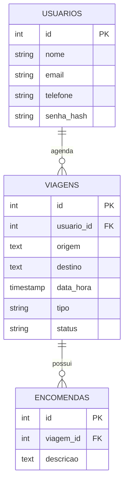

# 📦 Banco de Dados - App de Agendamento de Viagens (Flutter + PostgreSQL)

## 🧭 Visão Geral

Este banco de dados foi projetado para um aplicativo de agendamento de viagens no qual os motoristas transportam **pessoas** ou **encomendas**. Os dados são armazenados em PostgreSQL e acessados via backend.

---

## 🗄️ Tabelas do Banco de Dados

### 1. `usuarios`

Armazena informações dos clientes que agendam viagens.

| Campo        | Tipo         | Restrições               |
|--------------|--------------|---------------------------|
| id           | SERIAL       | PRIMARY KEY              |
| nome         | VARCHAR(100) | NOT NULL                 |
| email        | VARCHAR(100) | UNIQUE, NOT NULL         |
| telefone     | VARCHAR(20)  | —                        |
| senha_hash   | TEXT         | NOT NULL                 |

---

### 2. `viagens`

Armazena as viagens agendadas. Podem ser do tipo `'pessoa'` ou `'encomenda'`.

| Campo        | Tipo         | Restrições                                  |
|--------------|--------------|---------------------------------------------|
| id           | SERIAL       | PRIMARY KEY                                 |
| usuario_id   | INTEGER      | FOREIGN KEY → `usuarios(id)`, NOT NULL      |
| origem       | TEXT         | NOT NULL                                    |
| destino      | TEXT         | NOT NULL                                    |
| data_hora    | TIMESTAMP    | NOT NULL                                    |
| tipo         | VARCHAR(20)  | CHECK IN ('pessoa', 'encomenda'), NOT NULL  |
| status       | VARCHAR(20)  | DEFAULT `'pendente'`                        |

---

### 3. `encomendas`

Armazena os dados de encomendas (caso a viagem seja do tipo `'encomenda'`).

| Campo        | Tipo       | Restrições                              |
|--------------|------------|-----------------------------------------|
| id           | SERIAL     | PRIMARY KEY                             |
| viagem_id    | INTEGER    | FOREIGN KEY → `viagens(id)`, NOT NULL   |
| descricao    | TEXT       | —                                       |

---

## 🧩 Diagrama Entidade-Relacionamento (ER)



---

## 🧾 Script SQL

```sql
CREATE TABLE usuarios (
  id SERIAL PRIMARY KEY,
  nome VARCHAR(100) NOT NULL,
  email VARCHAR(100) UNIQUE NOT NULL,
  telefone VARCHAR(20),
  senha_hash TEXT NOT NULL
);

CREATE TABLE viagens (
  id SERIAL PRIMARY KEY,
  usuario_id INTEGER REFERENCES usuarios(id) ON DELETE CASCADE,
  origem TEXT NOT NULL,
  destino TEXT NOT NULL,
  data_hora TIMESTAMP NOT NULL,
  tipo VARCHAR(20) NOT NULL CHECK (tipo IN ('pessoa', 'encomenda')),
  status VARCHAR(20) DEFAULT 'pendente'
);

CREATE TABLE encomendas (
  id SERIAL PRIMARY KEY,
  viagem_id INTEGER REFERENCES viagens(id) ON DELETE CASCADE,
  descricao TEXT
);
```
